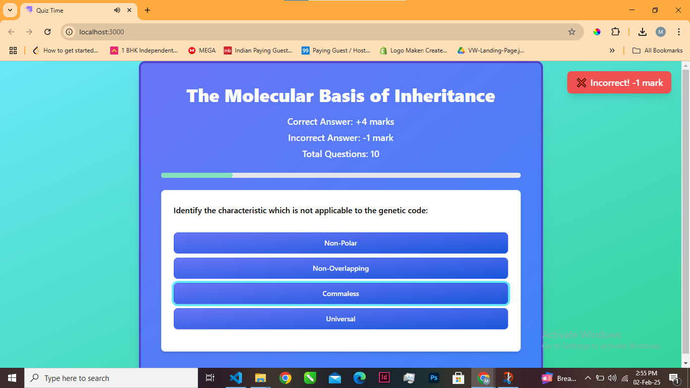
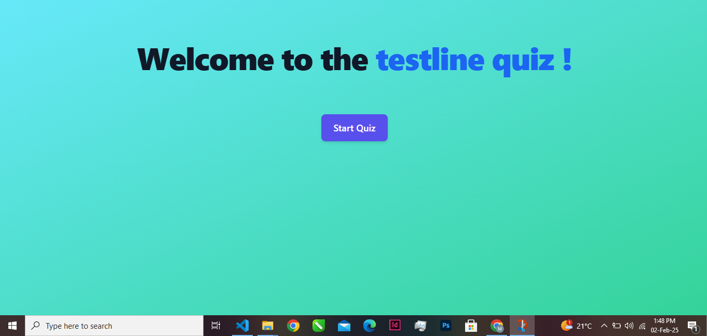
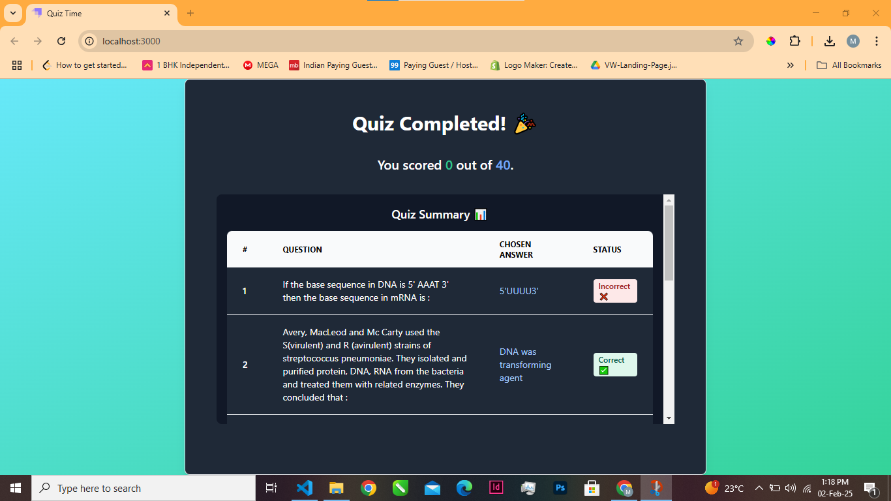

# 🎯 React Quiz Game



## 🚀 Overview

This is an interactive **React Quiz Game** that dynamically fetches quiz data and provides instant feedback on answers. It features an engaging UI built with **Flowbite-React, TailwindCSS, and Axios**, ensuring a smooth user experience.

**Demo** :[Link](https://quiz-time-brown.vercel.app/)

### ✨ Features

✅ Start Quiz with an animated button  
✅ Real-time scoring system (+4 for correct, -1 for incorrect)  
✅ Smooth progress tracking with a progress bar  
✅ Animated success and failure toasts  
✅ Win/Lose sound effects on answer selection  
✅ Responsive design with TailwindCSS  
✅ API-powered dynamic quiz questions

---

## 📸 Screenshots

### **Home Screen (Start Quiz Button)**



### **Question Screen**


### **Results Screen**



### 📽️ Demo Video

#### 🖥️ Desktop View

[Watch the video](https://drive.google.com/file/d/1Ibh8ZDHdAZeubpBjwA9meSqhcii1XWs3/view?usp=sharing)

#### 📱 Mobile View

[Watch the video](https://drive.google.com/file/d/1KWkBUqwHcR4Y2xcjuCc3zw31v6sJtPlZ/view?usp=sharing)

---

## 🛠️ Tech Stack

- **React** – Frontend framework
- **Flowbite-React** – UI components
- **TailwindCSS** – Styling
- **Axios** – API calls
- **React Hooks** – State management

---

## ⚡ Getting Started

### 📌 Prerequisites results

Make sure you have **Node.js** (>=16) and **npm** or **yarn** installed.

### 🔧 Installation

1️⃣ **Clone the repository**

```sh
git clone https://github.com/manishr7/Quiz-Time.git
cd quiz-app
```

2️⃣ **Install dependencies**

```sh
npm install  # or yarn install
```

3️⃣ **Start the development server**

```sh
npm run dev  # or yarn dev
```

4️⃣ **Open in browser**
Visit http://localhost:3000 to play the game.

---

## 🎮 How to Play

1️⃣ Click the Start Quiz button
2️⃣ Answer the multiple-choice questions
3️⃣ Get +4 points for correct answers and -1 point for incorrect ones
4️⃣ View your final score on the result screen

---

## 📌 Project Structure

```bash
/Quiz-app
│── /public
│── /src
│   ├── /components
│   │   ├── Question.js
│   │   ├── Result.js
│   │   ├── ProgressBar.js
│   │   ├── Quiz.js
│   ├── /api
│   │   ├── index.js (Fetches quiz data)
│   ├── /loader
│   ├── /assets
│   │   ├── /sounds
│   ├── App.js
│   ├── index.js
│   ├── index.css
│   ├── App.css
│── /walkthrough
│── /screenshots
│── package.json
│── tailwind.config.js
│── postcss.config.js
│── README.md
```

---

## 🔗 API Integration

This project fetches quiz data from an external API using Axios.
Modify api/index.js to use your own API endpoint if needed.

---

## 🤝 Contributing

Feel free to contribute to Quiz-Time by submitting pull requests or reporting issues!

---

## 📜 License

This project is open-source and available under the MIT License.

---

## 💡 Author

👤 Manish Rawat
🔗 [LinkedIn](https://www.linkedin.com/in/manishrawat10/)
